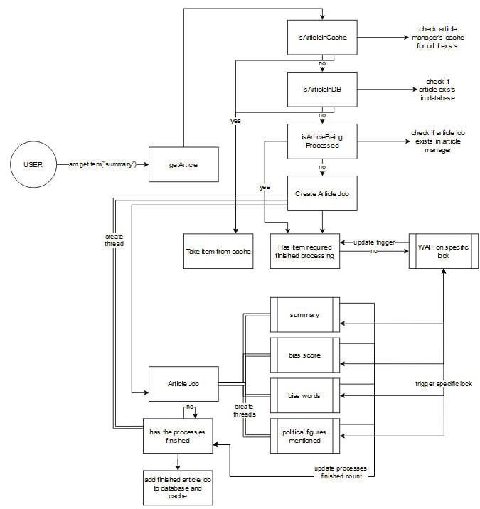

# Utils
The utils directory maintains the sessionManager (Client Manager Layer) with additional ML prompts and sub-functions.
The ``SessionManager`` must be initialised at the beginning of each session (in ``API.py``).

The following implementation diagram outlines the multi-threading capabilities of the articleManager class, and the automatically spawning of subtasks




initialise article manager
```
am = ArticleManager(3)
```

### retrieve unbiased summary from a given url (url1)

```am.getItem(url1, SUMMARY)```
### clean threads at the end of functionality
```
am.clean()
: int, ys: List[float]) -> str:
```
Example:
```python
am = ArticleManager(2)
url1 = "https://theconversation.com/justin-trudeaus-india-accusation-complicates-western-efforts-to-rein-in-china-213922"
url2 = "https://www.abc.net.au/news/2023-09-20/new-zealand-hit-by-earthquake/102877954"
url3 = "https://www.9news.com.au/national/victoria-news-officers-injured-in-police-chase-armed-man-on-the-run-in-katandra-west-in-northern-victoria/6ee1eb85-b5a6-45ef-a991-a3292490ba98"
print(am.getItem(url1, SUMMARY))
print(am.getItem(url1, BIAS_RANGE))
print(am.getItem(url2, BIAS_WORDS))
print(am.getItem(url3, SUMMARY))
am.clean()
```

## Using the SessionManager

```python
sm = SessionManager(2)
url1 = "https://theconversation.com/justin-trudeaus-india-accusation-complicates-western-efforts-to-rein-in-china-213922"
url2 = "https://www.abc.net.au/news/2023-09-20/new-zealand-hit-by-earthquake/102877954"
url3 = "https://www.9news.com.au/national/victoria-news-officers-injured-in-police-chase-armed-man-on-the-run-in-katandra-west-in-northern-victoria/6ee1eb85-b5a6-45ef-a991-a3292490ba98"
print(sm.getArticleItem(url1, SUMMARY))
sm.am.clean()
sm.tdc.closeConnection()
```
